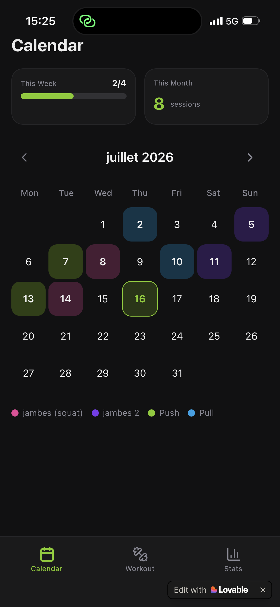
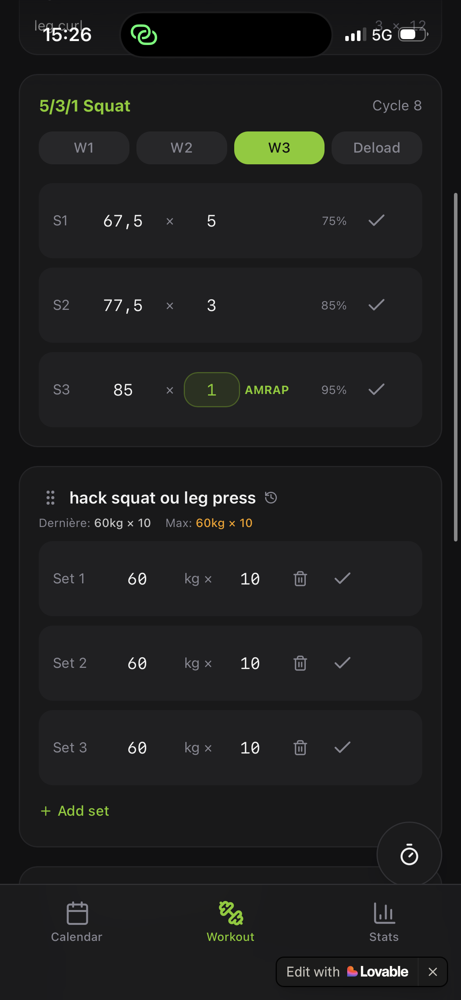
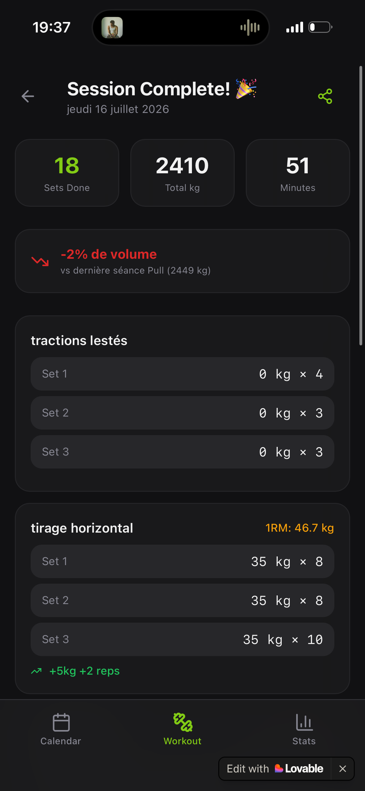
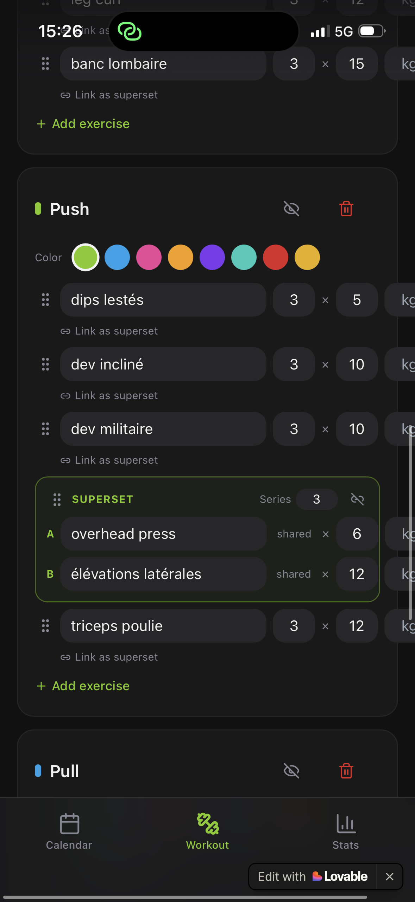
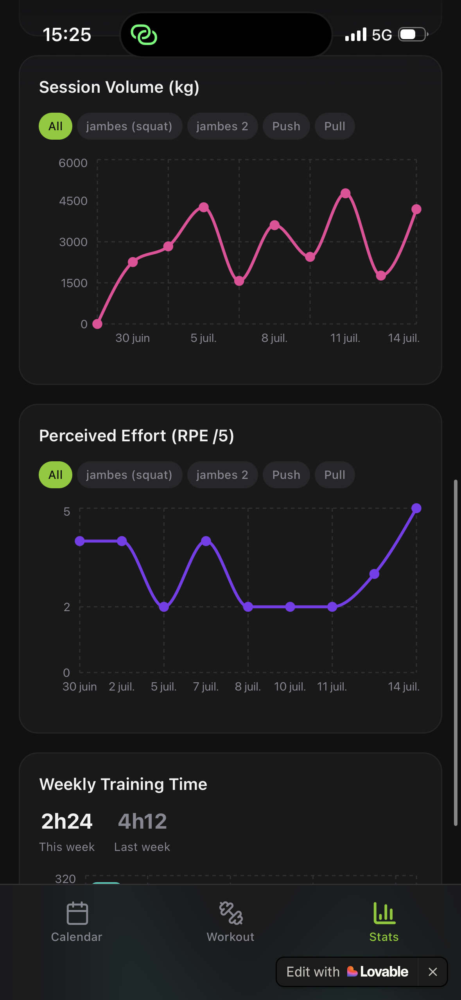
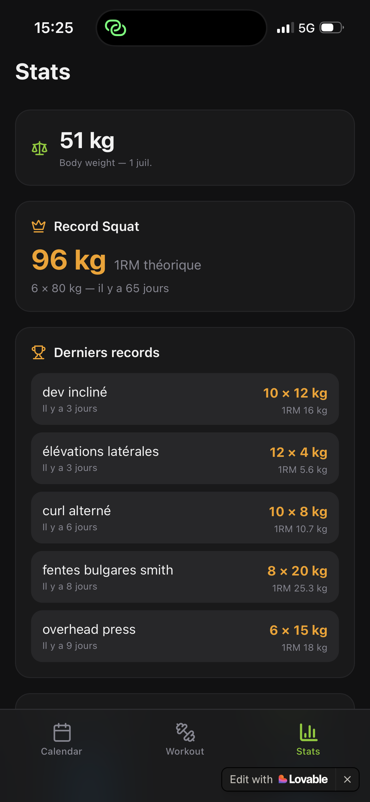

# Strength & Calisthenics Tracker
 
> A mobile-first web app (PWA) for hybrid strength training (weightlifting + calisthenics), custom-built and continuously refined since March 2026 based on real day-to-day usage.
 
**🔗 Repo:** [lisa-coicadan/strength-tracker](.)
**🛠️ Built with:** [Lovable.dev](https://lovable.dev)
**📅 Status:** actively maintained, evolving continuously
 
---
 
## 💡 Why this project
 
Mainstream fitness tracking apps handle two things poorly, which I needed on a daily basis:
- **hybrid sessions**, mixing loaded exercises and bodyweight work in the same workout,
- **programmed progressive overload** (5/3/1-style strength cycles on Squat, with automatic Training Max increments).
Instead of working around these limitations with spreadsheets, I built my own tool: fully local (no external cloud database, JSON export/import for portability), designed to be usable in a few seconds at the gym, even offline.
 
---
 
## 📱 Preview
 
| Weekly calendar & tracking | Active session (5/3/1 Squat) | Session summary |
|---|---|---|
|  |  |  |
 
| Superset configuration | Analytics — volume & RPE | Analytics — personal records |
|---|---|---|
|  |  |  |
 
---
 
## 🚀 Features
 
### Active session mode
- Collapsible overview of the session plan (exercise / sets / reps)
- Global timer, started when the session begins
- Contextual reminders: last session's load and personal record for each rep count
- Smart auto-fill: entering the load on the first set duplicates it across the following sets
- Session persistence: switch tabs to check stats without losing the timer, checked sets, or entered loads
### Advanced business logic
- **Native superset engine**: two exercises share a common set count while keeping fully independent load and progression history
- **Fuzzy exercise normalization**: groups spelling variants (`RDL`, `rdl`, `RDL barbell`…) under a single analytics entity
- **Strength cycle automation**: detects the end of a Squat cycle and automatically increments the Training Max (+2.5 kg), resetting to week 1
- **Local-first backup**: JSON export/import to prevent data loss from cache clearing or device changes
### Data & analytics
- **Theoretical 1RM calculator** (Epley formula), only logging a new record when the calculated 1RM beats the previous historical max
- **Personal record detection**: absolute Squat PR highlighted, plus a Top 5 of most recent records across all lifts, with dynamic "days ago" tracking
- **Cumulative tonnage chart**, filterable by session type, with a direct progression comparison vs. the previous session of the same type
- **Training frequency tracking** (4 weeks / 16 weeks / all-time), including zero-session weeks, for an honest read of consistency
### Mobile UX
- Stabilized input focus on mobile to prevent the keyboard from closing on every keystroke
- Smooth drag-and-drop to reorder exercises and superset blocks
- Shareable session summary card, optimized for screenshots
- Non-blocking rest-timer beep via the Web Audio API, layered over ongoing music/podcasts without interrupting playback (iOS-compatible)
---
 
## 🛠 Tech stack
 
| Layer | Choice |
|---|---|
| Frontend | React, TypeScript, Tailwind CSS |
| State management | React Context API (active session persistence) |
| Storage | LocalStorage / IndexedDB — local-first architecture |
| Audio | Web Audio API |
| Drag & drop | custom touch events / `@hello-pangea/dnd` |
| Build platform | Lovable.dev |
 
---
 
## 📅 Development history
 
Built iteratively, with each stage driven by a real need identified through actual use:
 
1. **Foundations** — fully local architecture, base screens (Calendar, History, Analytics)
2. **Data structure & automation** — RPE scale moved from /10 to /5, default rules (60 min session length), Squat cycle logic (+2.5 kg)
3. **Targeted UX fixes** — mobile keyboard-closing bug, set auto-fill correction
4. **Supersets & drag-and-drop** — reworked local data model to support nested exercise objects
5. **Analytics & polish** (current) — 1RM calculation, global cross-tab persistence, layered audio beep, time-formatted stats
---
 
## 🤖 Approach
 
This project was built through AI-assisted development on Lovable: rather than writing code line by line, I owned the full product specification — defining requirements, prioritizing features, iterating continuously based on my own gym usage, and writing precise prompts to guide each evolution (data structures, business rules, UX fixes).
 
This reflects:
- the ability to **specify complex functional requirements** (supersets, strength cycles, exercise normalization) precisely enough for an AI to implement correctly
- **product iteration driven by real usage data** (the analytics views were added because I needed them to track my own progression)
- hands-on experience with **prompt engineering applied to product development**
---
 
## 📄 License
 
MIT — personal project, free to reuse.
